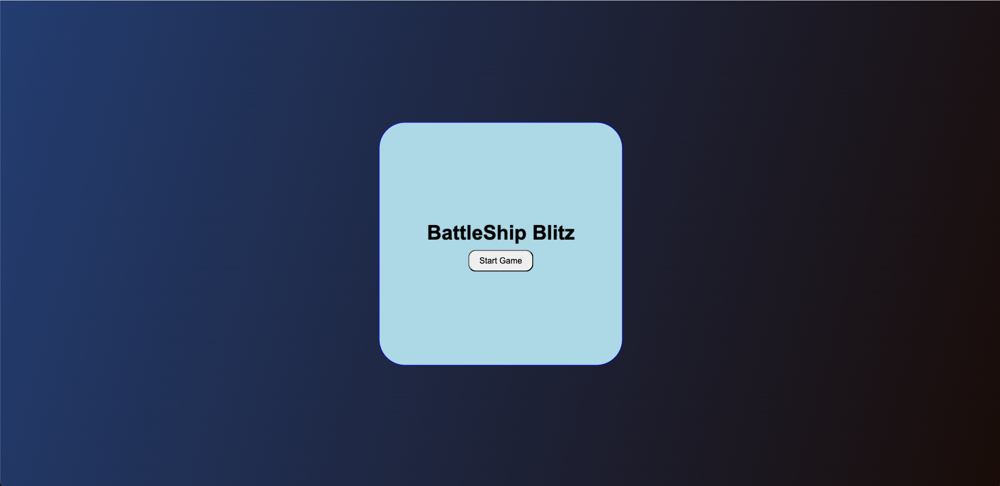
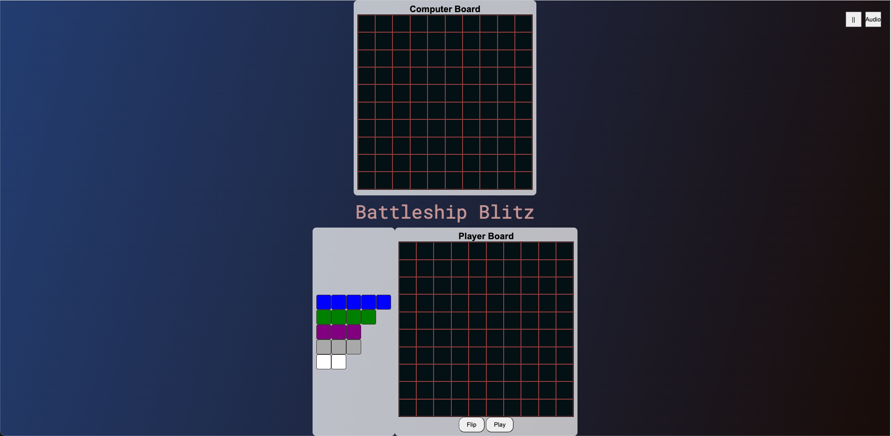
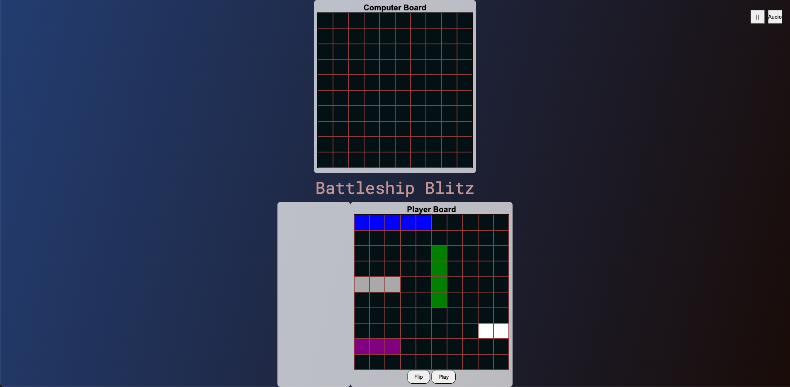
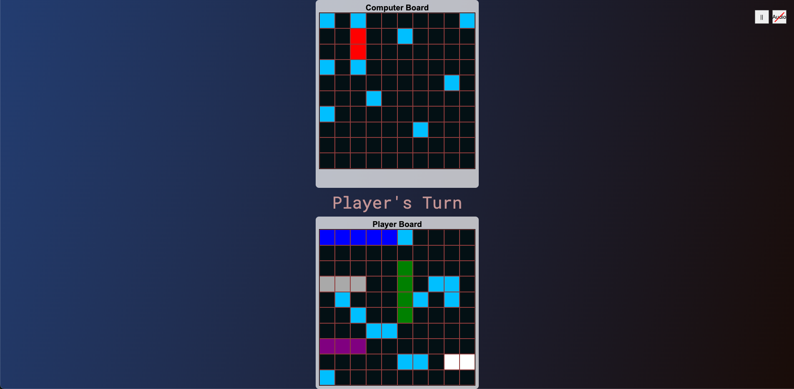

<section id="header">
  <div align="center" id="header">

  # BattleShip Blitz

  **Written by [Naeim Salib](https://www.linkedin.com/in/naeimsalib/)**
  <br>
  </div>


## Game Story

BattleShip Blitz is a classic naval warfare game where you command a fleet of ships and engage in strategic battles against an AI opponent. Your mission is to locate and sink the enemy's fleet before they sink yours. Use your tactical skills to outsmart the AI and claim victory on the high seas.

## Key Points

- **Game Setup**: Place your ships on the board strategically to avoid detection by the enemy. You can drag and drop ships to position them and use the flip button to change their orientation.
- **Turn-Based Gameplay**: The game alternates turns between you and the AI. On your turn, click on the enemy's board to launch an attack. The AI will do the same on its turn.
- **Hit and Miss**: When you hit an enemy ship, the cell will turn red, and a hit sound will play. If you miss, the cell will turn blue, and a miss sound will play.
- **Pause and Resume**: You can pause the game at any time by clicking the pause button. A pause menu will appear, allowing you to resume the game when ready.
- **Sound Control**: Use the sound button to toggle game sounds on and off. When muted, a red diagonal line will appear on the button.
- **Game Over**: The game ends when all ships of one side are sunk. An alert will display the winner, and the game will reset.

## How to Play

1. **Start the Game**: Click the "Start Game" button on the main menu to begin.

   

2. **Place Your Ships**: Drag and drop your ships onto the player board. Use the flip button to change their orientation.
   
   
   - You can Use the Flip Button to flip the ships orientation
   - You can also change the position of the position of the last shipped place as many times as you want, but once you move to the next ship it is not movable
3. **Begin Battle**: Once all ships are placed, click the "Play" button to start the battle.
   
4. **Take Turns**: Click on the enemy board to attack. The AI will take its turn after yours.
5. **Pause and Resume**: Use the pause button to pause the game and the resume button to continue.
6. **Toggle Sound**: Click the sound button to mute or unmute game sounds.

## Technologies Used

- **HTML**: For the structure of the game.
- **CSS**: For styling the game elements.
- **JavaScript**: For game logic and interactivity.

## Author

**Naeim Salib** - [LinkedIn](https://www.linkedin.com/in/naeimsalib/)

Enjoy playing BattleShip Blitz and may the best strategist win!

## Play the Game

You can play BattleShip Blitz online at the following link:
[Play BattleShip Blitz](https://naeimsalib.github.io/Battle-Ship/)

## Deploying the Game on Your Own Machine

To deploy BattleShip Blitz on your own machine, follow these steps:

1. **Clone the Repository**: Clone the repository to your local machine using the following command:

```bash
git clone https://github.com/naeimsalib/Battle-Ship.git
```

2. **Navigate to the Project Directory**: Change to the project directory:

```bash
cd Battle-Ship
```

</section>

3. **Open the Game in Your Browser: Open the index.html file in your preferred web browser:**

### By following these steps, you can play BattleShip Blitz on your own machine.
